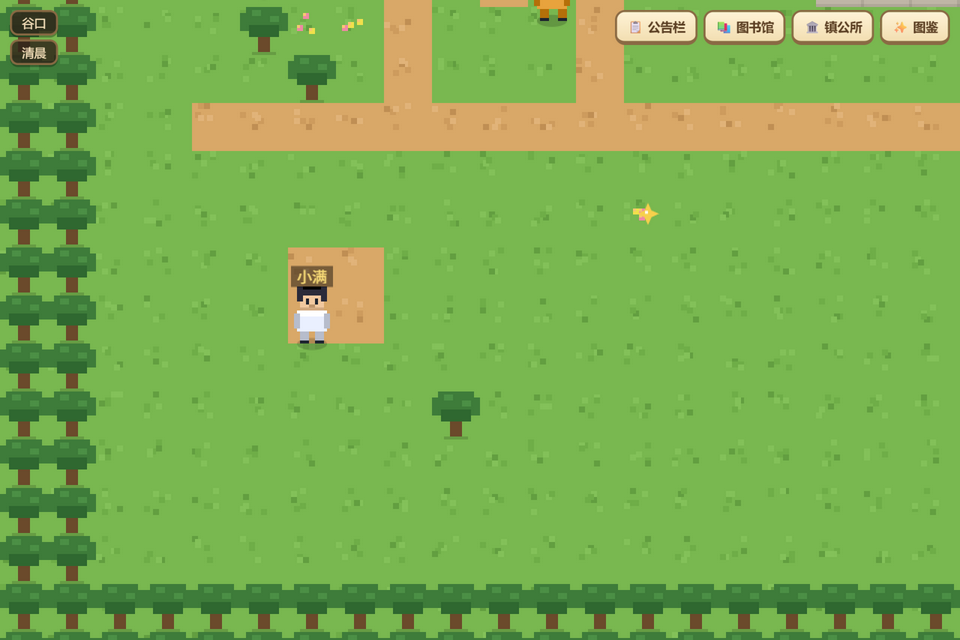

# 树洞谷 Shudong Valley

一座住着「知乎居民」的像素小镇。你扮演一个刚搬来的旅人，在谷里自由行走；八位有自己日程、话题和脾气的居民在这里生活——他们会主动和你搭话，会记得你上次说过的话，还会在傍晚去湖边散步。

玩到深处，你还可以在镇公所用**一句话**邀请一位新居民入住，比如"一个总在减肥的火锅博主"——TA 会带着自己的人设出现在小镇上。



## 玩法

- **自由行走**：WASD / 方向键 / 点击地面移动，44×34 的谷地里有广场、图书馆、酒馆、面包房、花田、菜地和一条河
- **面对面聊天**：走近居民按 `E`，像打游戏 NPC 一样对话；聊过什么，TA 都记得（对话框上会显示"记得你"的印象）
- **居民是活的**：每人有自己的日程（阿卷上午在图书馆、强哥的菜地、阿漂全天钓鱼）；你在附近站一会儿，他们可能主动跟你搭话；居民之间也会闲聊
- **一句话邀请新居民**：镇公所 → 描述一个人物 → TA 入住并开始生活（每人限邀 3 位，全镇 12 位上限）
- **公告栏 / 图书馆**：接了知乎热榜和知乎知识内容，站在公告栏前刷今天的热点，去图书馆翻书
- **灵感碎片**：谷里散落着 10 枚会发光的碎片，收集齐能看到一册"金句图鉴"
- **昼夜**：跟随时钟变化，黄昏有暖光，夜晚窗户会亮

## 运行

需要 Node.js 18+，无需安装依赖：

```bash
node server/index.js
# 打开 http://localhost:8787
```

## 可选配置

所有能力都是"配了就增强，不配也能玩"：

```bash
# 居民对话走 GLM（智谱）大模型，对话更活；不配则用内置台词引擎
export GLM_API_KEY=your_key
export GLM_MODEL=glm-4.7-flash   # 默认值，免费档

# 公告栏展示实时知乎热榜、镇长热线接知乎直答；不配则用内置内容
export ZHIHU_ACCESS_SECRET=your_access_secret
```

密钥只从环境变量读取，不进代码。

## 技术结构

```
web/                原生 ES Module 前端，零框架
  engine/sprite.js  程序化像素美术：所有瓦片、建筑、角色精灵都由代码逐像素画出，无任何图片素材
  engine/game.js    渲染循环 / 碰撞 / BFS 寻路 / 相机 / NPC 日程状态机 / 后台心跳
server/
  index.js          零依赖 Node HTTP：静态托管 + API + SSE 镇内广播
  engines/chat.js   对话编排：人设 + 长期记忆 + 场景 → 模型回复 → 事后印象
  engines/custom.js 一句话 → 新居民人设卡
  services/llm.js   GLM（OpenAI 兼容端点）与内置台词引擎双模，自动降级
  services/memory.js 居民记忆：按 居民×玩家 落盘 JSON，滚动窗口
  world/            地图数据与八位居民的人设、日程、台词
```

几个设计决定：

- **像素全部程序化生成**：角色是四方向三帧的合成精灵表，改个发色参数就能换装；整图静态层一次绘制，运行时只画实体层
- **世界在后台也活着**：浏览器标签页不可见时 `requestAnimationFrame` 会暂停，因此有一条低频心跳兜底，保证日程与对话状态不错乱
- **离线可玩**：没配任何密钥时，对话走台词引擎、内容走内置缓存——演示环境永不翻车

## 用到的开放能力

- [智谱开放平台](https://open.bigmodel.cn/)：居民对话与新居民人设生成（GLM，OpenAI 兼容接口）
- [知乎数据开放平台](https://developer.zhihu.com/)：热榜、知乎直答
- 知乎黑客松赛事内容接口：图书馆知识书架

## License

MIT
